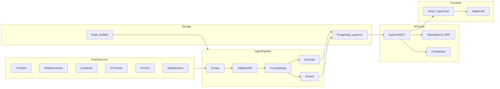

# WhatsUpNYC — NYC Event Aggregator

Hyperlocal event discovery for New York City: multi-source scrapers, validation, geocoding, **hybrid search** (Postgres FTS + pgvector RRF), local AI enrichment, and a React + Mapbox 3D frontend.

> **Demo UI:** 3D Mapbox map with semantic/hybrid search. Capture a screenshot per [docs/SCREENSHOT.md](docs/SCREENSHOT.md).

## Architecture



## Design decisions

| Choice | Rationale |
|--------|-----------|
| **PostgreSQL + pgvector** | Colocate events and embeddings; HNSW cosine search without a separate vector DB (cost + latency). |
| **Hybrid search (FTS + vectors, RRF)** | Lexical search catches exact venue/artist names; semantic search handles paraphrases. Reciprocal Rank Fusion merges ranked lists without score normalization ([Cormack et al., 2009](https://plg.uwaterloo.ca/~gvcormac/cormacksigir09-rrf.pdf)). |
| **Local Transformers (`@xenova/transformers`)** | Offline-first embeddings (BGE-small-en-v1.5), NER, and classification in worker threads — reproducible, no per-query API cost. |
| **BullMQ + Redis** | Durable background ingest, geocode, and embed jobs with retries; API stays read-focused in production. |
| **Split API / worker containers** | Scrapers and Chromium isolated from the HTTP tier; scale and restart independently. |

## Performance

Run benchmarks after ingest (`npm run bench:*` in `backend/`). Example dev-machine numbers:

| Metric | Value |
|--------|-------|
| Ingest validate throughput | ~6,000+ events/sec (fixture batch, `SKIP_GEOCODE=true`) |
| Dedupe @ 0.85 threshold | Precision 1.0 / recall 1.0 on golden duplicate pairs |
| Hybrid search | Populate `benchmarks/fixtures/search-golden.json` with labeled event IDs post-ingest for MRR/P@5/NDCG |

Reports are written to `backend/benchmarks/reports/*.json`.

## Production stack (Docker)

```bash
docker compose --profile prod up
```

Services: **Postgres** (pgvector), **Redis**, **API** (`Dockerfile.api`), **Worker** (`Dockerfile.worker` — scrapers + BullMQ).

| Variable | Purpose |
|----------|---------|
| `DATABASE_URL` | PostgreSQL connection string |
| `REDIS_URL` | Redis for cache + BullMQ |
| `API_KEYS` | Comma-separated keys — **required** for all `GET /api/events` routes in production |
| `METRICS_TOKEN` | Prometheus scrape auth for `GET /metrics` |
| `MAPBOX_ACCESS_TOKEN` | Geocoding (server-side) |

Never set `SYNC_INGEST=true` in production (runs scrapers on the API process).

Run migrations: `cd backend && DATABASE_URL=... npm run migrate`  
Run worker separately: `cd backend && npm run worker`

## Ship gate

**Do not push to GitHub until release verification passes.** See [SHIP_GATE.md](SHIP_GATE.md).

```bash
cd backend && npm run verify:release
```

Includes unit tests, production-profile ingest + smoke, **data quality audit**, and frontend build.

## Quick start

### Prerequisites

- Node.js 18+
- Mapbox public token (`pk.`) in `frontend/.env.local`

### Install

```bash
npm run install-all
```

### Environment

Copy `backend/env.example` to `backend/.env`.

| Setting | Typical local dev |
|---------|-------------------|
| `PORT` | `8000` |
| `SCRAPER_CONCURRENCY` | `1` |
| `USE_LOCAL_AI` | `false` for ingest speed |
| Core scrapers | **The Skint**, **Oh My Rockness**, **Eventbrite** |

Frontend (`frontend/.env.local`):

```env
VITE_MAPBOX_ACCESS_TOKEN=pk.your_token
VITE_API_KEY=your_api_key_here
```

### Run

```bash
npm run dev
```

Backend: http://localhost:8000 — Frontend: http://localhost:3000

### Search API

```bash
# Keyword (in-memory substring on loaded page)
curl -s -H 'x-api-key: KEY' 'http://localhost:8000/api/events?search=jazz'

# Hybrid semantic + BM25 (RRF) — requires indexed vectors
curl -s -H 'x-api-key: KEY' 'http://localhost:8000/api/events?search=live%20music&semantic=true'
```

### Data quality

```bash
curl -s -H 'x-api-key: KEY' http://localhost:8000/api/metrics/quality | jq
cd backend && npm run audit:quality
```

### Health check

```bash
curl -s http://localhost:8000/api/health | jq '{ status, degradedSources, eventCount }'
```

## Event sources

| Source | Default ingest | Status |
|--------|----------------|--------|
| The Skint | Yes | Primary |
| Oh My Rockness | Yes | Primary |
| Eventbrite | Yes | Secondary |
| NYC Go / Parks / Union Square | No | Opt-in via `SCRAPER_*_ENABLED` |
| Reddit | CLI only | `npm run ingest -- --reddit` |

## Tests and benchmarks

```bash
cd backend && npm run test:unit
cd backend && npm run test:property
cd backend && npm run typecheck
cd backend && npm run bench:dedupe
cd backend && npm run bench:ingest
cd ../frontend && npm run test -- --run && npm run build
```

## Agent conventions

Use Cursor project rules and [SHIP_GATE.md](SHIP_GATE.md) before pushing — run `npm run verify` from the repo root.

## License

MIT
