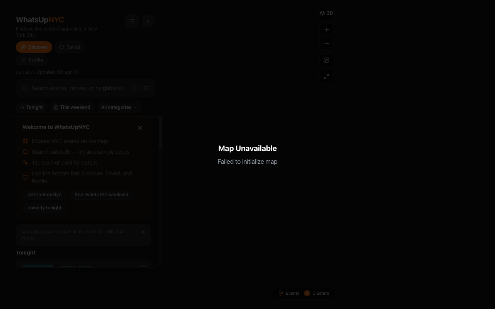
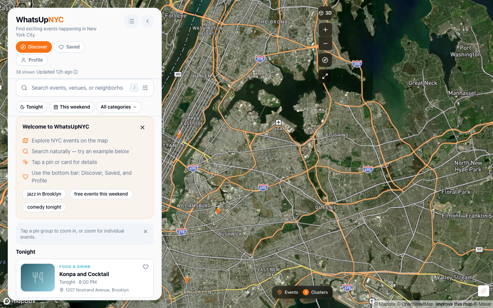
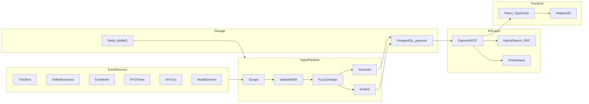

# WhatsUpNYC

[](https://github.com/jaydenstab/NYC-Events/actions/workflows/ci.yml)
[](#license)

Hyperlocal event discovery for New York City — multi-source scrapers, validation, geocoding, **hybrid search** (Postgres FTS + pgvector RRF), and a React + Mapbox 3D map.





_Screenshots: capture at 1280×800 with `frontend/.env.local` (`VITE_MAPBOX_TOKEN`). Dark is default; light theme under Profile → App appearance._

**Live demo:** Deploy via [Railway](docs/DEPLOY_RAILWAY.md) — set your URL in this README after first deploy.

**Search quality:** After ingest, label queries with `npm run label:search-golden` then run `npm run bench:search` (hybrid P@5 vs FTS).

**Stack:** React · TypeScript · Mapbox GL · Node · Express · PostgreSQL/pgvector · Redis · BullMQ · Docker

**Features**

- Multi-source ingest pipeline with validation, dedupe, and geocoding
- Hybrid search — keyword FTS plus semantic vectors (reciprocal rank fusion)
- Mapbox 3D map with pin clustering, saved events, and semantic search UI
- Split API / worker architecture with CI and release ship gate

## Architecture



## Quick start

**Prerequisites:** Node.js **20+**, Mapbox public token (`pk.…`)

```bash
git clone https://github.com/jaydenstab/NYC-Events.git
cd NYC-Events
npm run install-all

cp backend/env.example backend/.env
cp frontend/env.local.example frontend/.env.local
# Edit tokens locally — never commit .env files

npm run dev
# Backend http://localhost:8000  ·  Frontend http://localhost:3000

npm run ingest
curl -s http://localhost:8000/api/health | jq '{ status, eventCount }'
```

Without ingest, the UI may show demo fallback events. Full setup (env tables, API, Docker): [docs/SETUP.md](docs/SETUP.md).

## Documentation

- [Deploy on Railway](docs/DEPLOY_RAILWAY.md) — public read-only demo (HTTPS, Postgres, worker)
- [Setup & API](docs/SETUP.md) — environment, secrets, curl examples, Docker, event sources
- [Ship gate](SHIP_GATE.md) — release verification (`npm run verify`)
- [Roadmap](ROADMAP.md) — what's built, near-term priorities, and deprecated APIs

## License

MIT
